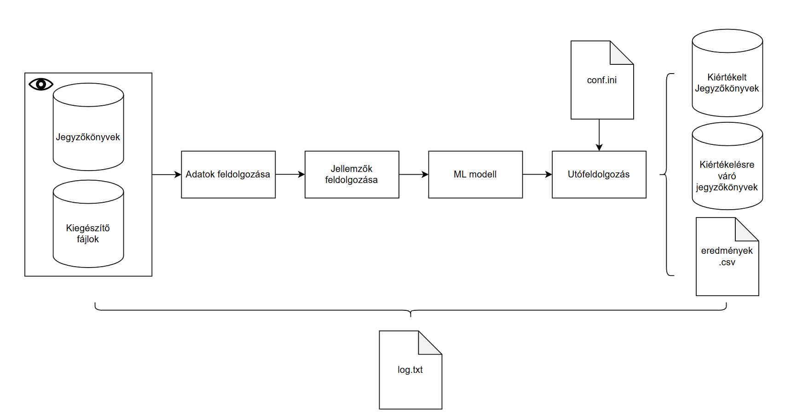
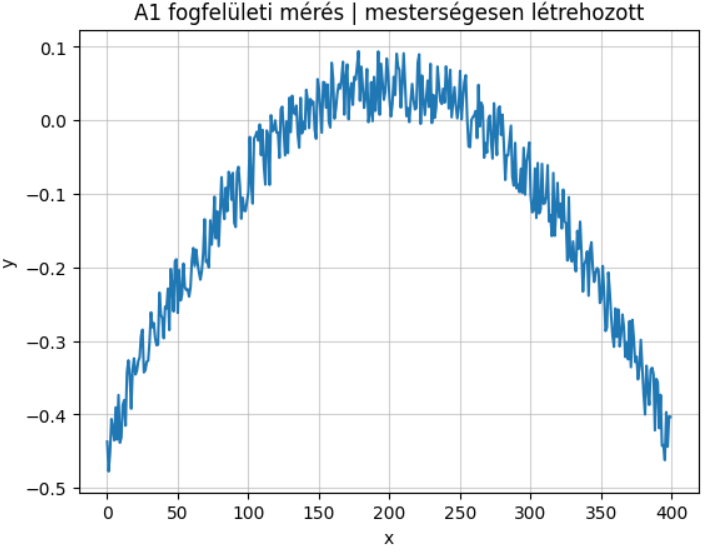
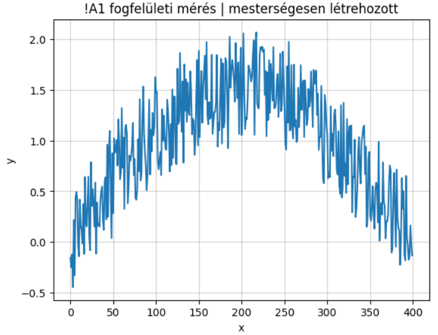

# Gepi-tanulas-integralasa-alkatresz-minoseg-osztalyozasi-folyamatba
Szakdolgozatnak a minta kódjai

A szakdolgozat egy valós ipari rendszer megoldásáról szól. Ennek okán az eredeti kód egyáltalán nem vagy anonimizálva kerülnek feltöltésre.

A feltüntetett rendszer architektúrából nem kerül bemutatásra a fájlok feldolgozása fejezet, így ezzel együtt a fájl objektum sem.
Az adatok melyek elérhetők itt mesterséges adatpontok melyek a lefutási görbéket szimulálják.
Mindegyik adatpont 16 lefutást tartalmaznak mindegyike 400 adatpontból áll.
Ezen lefutások kisebb nagyobb kilengésekkel rendelkeznek ezzel szimulálva az A1/!A1 osztályokat.

Ezeken hajt végre feature kinyerést a feature_preprocessing modul.

A main a fő futtató fájl mely az egész rendszert kezeli.

-----------------------

Fontos paraméterek a szakdolgozathoz:

Rendelkezésre álló hardware:

CPU: 13th Gen Intel(R) Core(TM) i7-13850HX
GPU: NVIDIA RTX 3500 Ada Generation Laptop GPU
RAM: 64GB
ESZKÖZ: Laptop

Felhasznált/optimalizált hiperparaméterek a modellekhez:

param_grid = {
    #"n_estimators": [100, 200, 300],
    #"learning_rate": [0.01, 0.05, 0.1],
    #"max_depth": [2, 3, 4, 5,6,7, None],
    #'max_iter': [50,100,300],
    #"min_samples_split": [2, 5, 10],
    #"min_samples_leaf": [5, 15, 30],
    #'C': [0.01,0.05,0.1,0.2,0.5,1.0,2.0,3.0],
    #'subsample':[0.5,0.6,1.0]
}

Ezen paramétereket azon modelleknél optimalizáltuk ahol elérhető volt számunkra. Például a LOGR-nál csak a C hiperparamétert optimalizáltuk.
